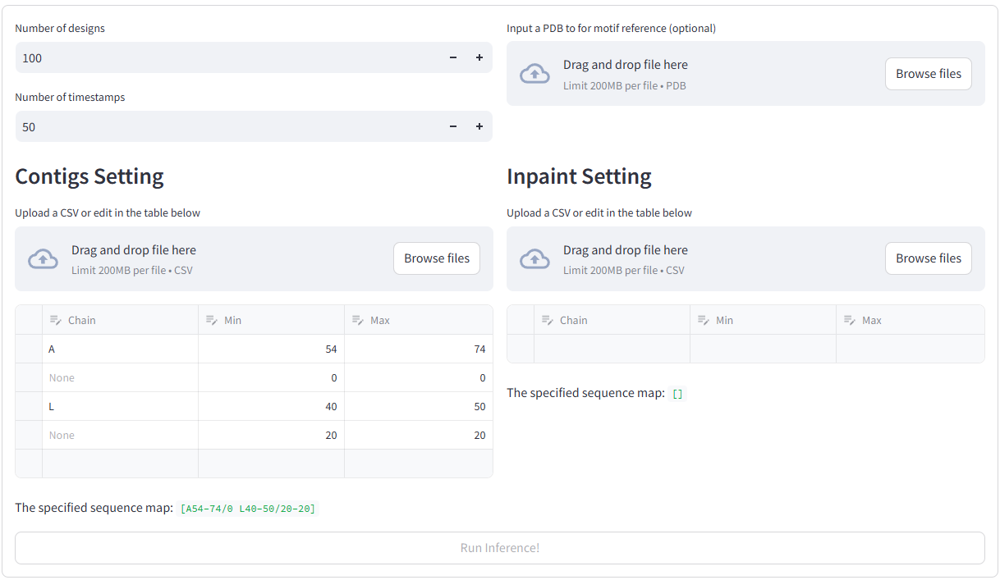
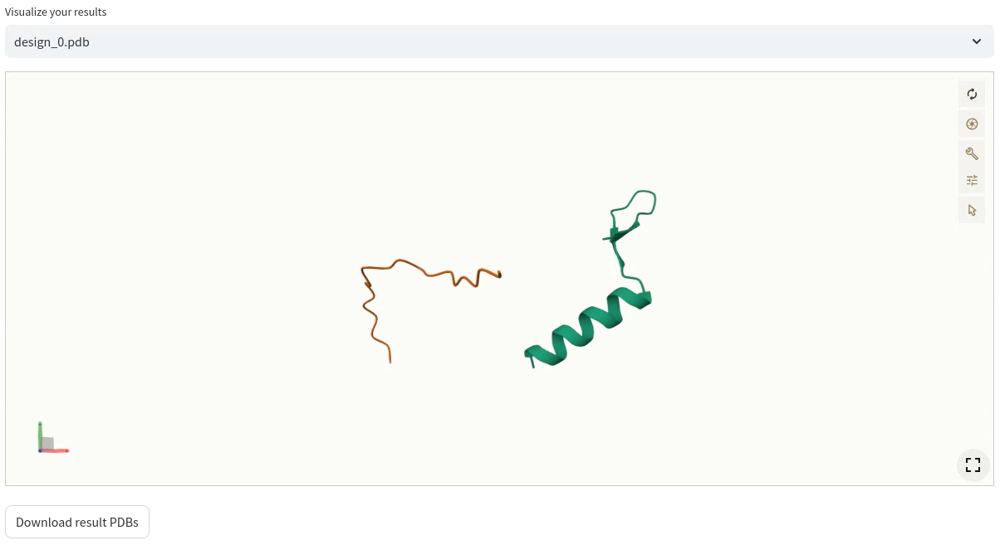

# ProteinDesignGUI


Implementing RFdiffusion-based protein design as online GUI, powered by streamlit.

## User Guide

Clone the repo and install the required packages.

If using a github installed RFdiffusion:

```bash
conda activate SE3nv    # to make sure that the GUI can call RFdiffusion
pip install streamlit streamlit_molstar PyYAML
```

Run the command to start the server (in `SE3nv`).

```bash
conda activate SE3nv
streamtlit run Home.py
```

### Motif Scaffolding

On the app's main page, there are 5 paramters for specification:

1. **#designs**: Set the number of scaffold designs to generate.
2. **#timestamps**: Configure the number of timestamps for diffusion (>=15, required by RFdiffusion).
3. **Protein Upload**: Upload a PDB file for use as a motif reference.
4. **Contigmap Settings**: Use the data editor or upload a CSV.
   * **Contig**: Configure the ranges of motifs and scaffolds.
   * **Inpaint**: Optional. Customize the inpainting sites on the motif.



#### Notices on the use of data editor

There are 3 fields for specifying the contig position: chain type, min length, max length. Each row will be appended serially to
form a command accepted by RFdiffusion, rendered below the table.

* The first column relates to which chain in the uploaded PDB the contig belongs to. When specified, it's actually a motif, otherwise it will be
randomly generated and fitted to the rest of the structure.

* The min and max range (inclusive) determines the range of motif on the original chain. When the chain type is unspecified, it refers to
the length range of the generated sequence.

* To indicate a break, unset the chain type and set the min and max length as 0.

> In the above example, `[A54-74/0 L40-50/20-20]` means generating 2 sequences.
> 1. uses the 54th~74th aa on chain A (motif)
> 2. uses 40th~50th aa on chain L (motif) and appends a generated sequence of 20 aa (scaffold). 

#### Results

The results can be inspected via a molstar viewer. All the generated PDB will be listed in the combobox and you can choose
any one of them to visualize in the 3D scene.

All the files can be downloaded as a zip file.



---
